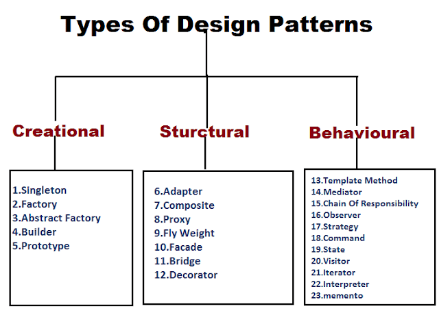

## Patterns Are Everywhere!
If you take a look around throughout a day, you will recognize patterns everywhere whether it be in your own life or in other's or in the world around you. A strong connection where planning and patterns is often seen is with construction and
city planners. As buildings, houses, streets, and other areas are built, they are built with a layout and purpose to make life for those who will use it easier. In this same way, there exists design patterns for programmers to structure and build
good codes.

## Blueprints for Coding
A design pattern is a set of rigid rules to assist with common design problems that arise with software engineering. Over time just like with building blueprints, issues have come up in coding which design patterns were created to reduce. Design
patterns are the blueprint of coding to create understandable, efficient, and adaptable codes and projects. Repetition can often lead to issues with coding and that's why patterns can help to resolve repetition. It's a healthy way of repetition
where everything is similar following the pattern to improve the efficiency of the code.

## How Patterns Are Used
For our project which was created to help gamers find other gamers on the UH campus and used many design patterns. A pattern used can be found in our components, where we have certain data like our PlayerCard.tsx component. The project contains
date for our players that use are site and it would be very repetitive to have an individual code for every player, instead we have a component that contains all the details a player gives and can display each player's info in the same way. It's
a design pattern that helped to reduce the repetition and increase the efficiency of the site and makes the coding more independent. We also made sure to separate our clients and pages to make sure that the site would run efficiently because
it helped to make our parts more independent so that we can work individually on the same parts without stepping on each others toes.

## Conclusion
Going into the project I don't think that we had these set "design patterns" when we started coding. Design patterns are something that are built through experience and time of coding and finding better and more efficient ways to create code just
like how blueprints are constantly changing to create better places for society. The more we code, the more we gain experience and find new design patterns to implement to improve our programs.

This essay was written by me with assistance of ChatGPT for ideas and clarity.
