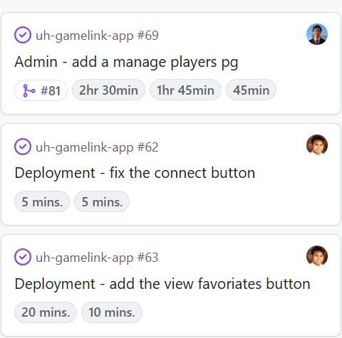

## Creating Effort Estimates
For me, a lot of my effort estimates were created using intuition based on my experience with coding. I’m not the most decorated programmer in any sense so I made sure to account for that when creating my effort estimates. Creating effort estimates had a few benefits for me and my group. It personally allowed me to divvy up time in my day that I would work on the project and plan to complete it in the estimated time. It also allowed my group to estimate how long issues would take so no one is picking up multiple hour long issues and working overtime on the project.

## Importance of Estimating
Tracking my effort was important to understand how long it takes for me to program some part but also to better understand how much work everyone is putting into the project individually. A lot of my tracking was just me looking at the time when I start coding and re-looking when I’m done coding. This was probably a little inaccurate because I often didn’t finish an issue in just one sitting or sometimes I would dose off and I tried to not include that time into my final time.

## Future for Estimations
I think for my estimations in the future, I would keep my technique of basing the estimations on my experience and just how long I think I’ll take. However, I would start to use a timer to better keep track of how long it takes for me to complete a certain task so that my future estimations can be more accurate to the actual time it’ll take me. I didn’t use AI for this because I think most of it is dependent on how fast I think I can code and how fast I actually do end up coding.
