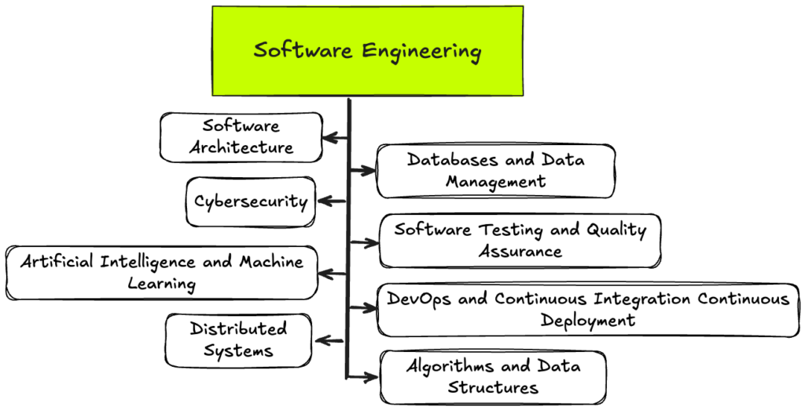

## Introduction
Before ICS 314, I wasn't fully sure what software engineering entailed. I thought that this class was just going to be like any other class where I just learn about simple programming and learn to just build smaller programs. However, software
engineering is much more broad than I initially thought. We built websites, learned about the important of systems and all these other concepts which are related to software engineering. There's a lot of little parts that make up software engineering
beyond just the websites and programs, it's about how to develop functional and efficient systems. Some of the main things that I learned which I found very important were coding standards, agile project management, and ethics in software
engineering.

## Coding Standards
Coding standards are an important rules or guidelines to follow while programming. In team environments, coding standards become even more important to ensure that everyone can work on the project without stepping on each others toes during commits.
Coding standards are crucial to keep codes consistent and to avoid a lot of bugs. Some examples are like the way that code is formatted or the naming of certain files or variables. Codes are much easier to work on and understand if they are formatted
neatly and consistently throughout the code. It'd be extremely difficult to understand a code if every single function has some different type of spacing or has unneccesary indents in certain lines. Likewise, if a code has one variable named
variableOne and another named VARIABLETWO, in a team environment it'd be tedious to make sure that variables are used correctly if they are named differently. This is why I've learned that coding standards are really important when coding, especially
when working collaboratively.

## Agile Project Management
A concept which I at first didn't really understand the meaning of yet I found it to be really important was agile project management. In ICS 314, during our group final project we used a style of APM which was called Issue Driven Project Management (IDPM).
It's a fancy way of this form of organization where you split the entire project into these much smaller tasks or issues and then individuals take responsibility for a task and complete it within a day or two. It may seem very basic like that's how
most groups work even outside of software engineering. However, I've realized how important it is in a subject like software engineering. Having four or more individuals all try to work on the same exact code is like asking 4 hungry kids to share
a pizza. It wouldn't work and it would be very chaotic, that's why IDPM is so important because it allowed us to visually see what others will be or are working on so we don't step on each others toes and create issues for one another. It was
also crucial to allow us to not be overwhelmed by the size of the project and just slowly complete these little steps until before you know it a project has come together.

## Ethics in Software Engineering
I've heard about ethics in software engineering although I didn't really think it to be an important topic. However as the world continues to grow toward a more technology based society, ethics have become a larger topic since technology and programs
continue to be able to do so much with artificial intelligence, facial recognition, surveillance, etc. Software is becoming a powerhouse in society and ethics are not important to ensure people's privacy isn't invaded or programs aren't created
for the wrong use.
