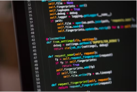

  

Last year I took the classes ICS 111, 114, 214, and 211. These classes are mainly for the fundamentals of coding and runtimes. The coding language taught was Java where I learned basic coding such as loops, objects, classes, interfaces, etc. Had to get used to the higher level of education and it's pacing and structure.

The role I played was that I took responsibility of my education, went to my classes, and tried my best to learn the coding languages. I was responsible for all of my work and any quizzes or exams that I had. It was much more independent and on me to stay on schedule and manage my other classes along with the heavy workload of ICS classes.

The first year of college taught me a lot about Java's syntax and basic coding language that translates into other languages. Along with the coding languages, I also learned a lot of self responsibility and independence on studying and working on more difficult projects. This experience was the foundation for my next year to work on more runtimes and the intricacies of software engineering.

