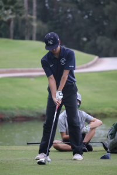

  

This project/experience involved me playing in my highschool varsity golf team. I've played on this golf team since sophomore year of highschool all the way up to senior year. The tournaments were individual golf but scores were combined as a team so it still required a good team environment to learn and encourage each other. The golf team was focused on winning and making each other better through comments and comraderie.

The role I played on the team was just another player on about a 5 man team. I put my best effort into trying to improve and put my best scores out on the golf course. Although golf is an individual sport, I made sure to connect with my teammates and we would help each other out with both golf and school. I did my best to maintain my individual performance while trying to balance in my school work and regular life.

This experience taught me so many different things. It didn't just teach me how to get better at golf but a wide range of things I plan to carry with me for the rest of my life. Golf is difficult and one the most mentally straining sports so this experience helped to improve my perseverance and mental toughness when struggling through something like coding. Golf has improved my discipline and also improved my skills doing extracurricular while balancing school along with it.
