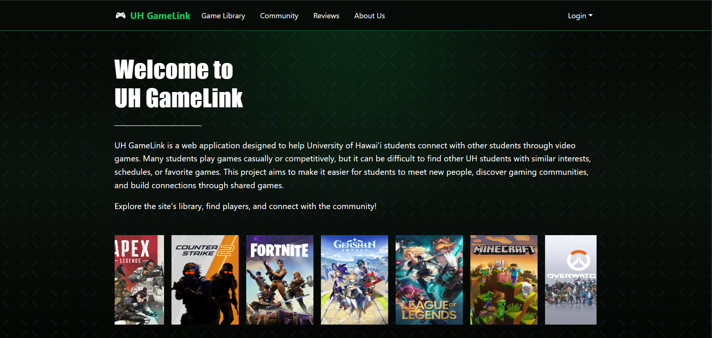

  

## Summary
UH Gamelink is a web application created by me and some classmates for a team project in ICS 314 in 2026. It was developed with the intent to solve an issue of UH Manoa gamers being unable to find other gamers to play with. The app is meant to help UH students connect with other students via their gaming interests and favorite games. Many students play games and it can be difficult to find people to play with so this app is to allow students to find those who are similar and have similar interests as well.

The application achieves these goals through it's variety of pages. For example, our app consists of a searchable game library, find players page, profile customization, etc. These pages were made with the intent make it simple and easy for UH students to navigate and find others quickly. The project was for the UH community but it also taught me and my teammates a lot of valuable things about web development.

## Technologies Used
UH GameLink was developed using modern full-stack web development technologies including:

- Next.js
- React
- TypeScript
- Prisma ORM
- PostgreSQL
- Playwright
- ESLint
- Bootstrap
- Vercel Deployment
- GitHub and GitHub Issues

## What I Learned
This experience allowed me and my group members to experience what it takes to build a web application to solve a real world issue that we spotted out. This project taught me the importance of agile project management when working in a group environment. Splitting a large amount of work up into pieces is a normal thing but this project helped me recognize how important it is when it comes to multiple programmers working together on a single code. It also helped me to better understand all the development environments we used like NextJs, Prisma, and Vercel. This project was important to get real world experience in programming and software engineering but it also was an opportunity to get experience in working in a group as I know most projects in the future won't just be on my own.

View our site: [UH Gamelink][https://uh-gamelink.vercel.app/]
View our github: [Github][https://github.com/uh-gamelink/uh-gamelink-app]
